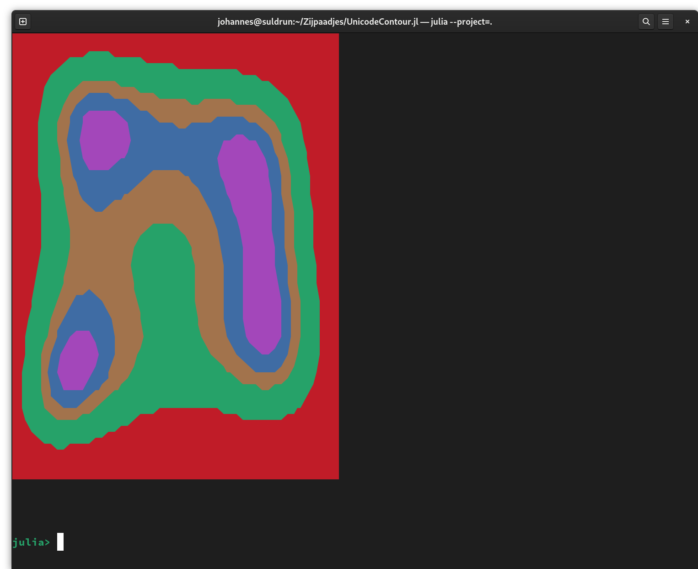

# UnicodeContour.jl
Uses the Unicode characters for old computer terminals to plot filled contours.

To test this demo, `julia --project=.`:

```
julia> using UnicodeContour: example
[ Info: Precompiling UnicodeContour [86a955c1-1565-4966-8dd5-26981150cda8]

julia> example()
```

And watch a miracle unfold!


